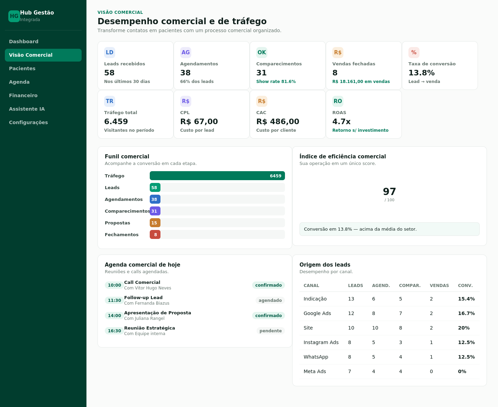

# Hub Gestão Integrada

Plataforma SaaS **multi-clínica** de gestão para clínicas médicas, odontológicas, estéticas, psicológicas e multiprofissionais — CRM de pacientes, agenda inteligente, financeiro, módulo comercial completo e assistente de IA em um único painel. Cada clínica que se cadastra tem seus próprios dados, totalmente isolados das demais.

Inclui também um **painel Master**, de uso restrito à equipe interna, com visão consolidada de todas as clínicas na plataforma, controle de usuários e envio de notificações que aparecem no Dashboard de todo mundo.

## Capturas de tela

| Landing (site institucional) | Login |
|---|---|
|  |  |

| Dashboard | Pacientes |
|---|---|
|  |  |

| Agenda | Financeiro |
|---|---|
|  |  |

| Visão Comercial |
|---|
|  |

## Arquitetura

- **Frontend:** React 19 + Vite, React Router, Recharts, Lucide
- **Backend:** Node.js + Express, API REST
- **Banco de dados:** PostgreSQL (hospedado no [Supabase](https://supabase.com)), acessado via `pg` — sem ORM, SQL direto
- **Multi-tenant:** toda tabela de dado de clínica tem `clinic_id`; todo acesso passa pelo `clinic_id` do usuário logado, garantido no backend (nunca confia em nada vindo do frontend)
- **Deploy:** um único serviço Node (backend serve a API e o frontend já compilado)

### Como o multi-tenant funciona

- Quem se cadastra em `/criar-conta` cria uma **clínica nova**, isolada, e vira o Administrador dela
- Toda rota de dado de clínica (`/api/pacientes`, `/api/agenda`, `/api/financeiro`, `/api/leads`...) filtra automaticamente por `clinic_id` no backend — uma clínica nunca vê dado de outra
- Contas **Master** (`perfil = 'Master'`) não têm `clinic_id` — em vez de acessar `/app`, acessam `/master`, com visão de todas as clínicas

## Autenticação e acesso

O site institucional (hospedado separadamente, ver `HUB-GEST-O-INTEGRADA`) é a porta de entrada pública, com os botões **Entrar** e **Criar conta grátis**. O login autentica direto na API deste projeto e redireciona:
- Perfil normal → `/app` (painel da clínica)
- Perfil `Master` → `/master` (painel administrativo da plataforma)

Todas as rotas de `/api/*` exigem token (JWT, válido por 30 dias), exceto `/api/auth/*` e `/api/health`. Senhas ficam com hash `bcrypt`, nunca em texto puro.

**Conta de demonstração** (clínica): `jonathan@clinicavitoria.com.br` / senha `clinica123`

**Contas Master:** 4 e-mails fixos com acesso (`jonathanborgesdev@hub.com`, `joycealvesmark@hub.com`, `beatrizvieirarh@hub.com`, `clararangelfinan@hub.com`) — senhas geradas e entregues fora deste repositório por segurança.

> Em produção, defina `JWT_SECRET` com um valor aleatório próprio (Render: Settings → Environment). Sem isso, o projeto usa um valor padrão de desenvolvimento.

## Painel Master

Acesso restrito por perfil (`Master`). Três áreas:

- **Clínicas** — todas as clínicas cadastradas na plataforma: pacientes, usuários, faturamento total, data de cadastro, status (ativa/suspensa), com botão para suspender/reativar
- **Usuários** — todos os usuários de todas as clínicas em uma lista só, com busca, criação de novos usuários (inclusive outras contas Master) e ativar/desativar
- **Notificações** — escreva um título + mensagem e envie; aparece como banner no Dashboard de todas as clínicas ativas até ser desativada

## Estrutura

```
clinic-hub-app/
├── backend/
│   ├── server.js               # servidor Express, todas as rotas montadas e protegidas
│   ├── db/
│   │   ├── pool.js              # conexão com o Postgres (Supabase)
│   │   ├── case.js              # conversão camelCase (JS) <-> snake_case (SQL)
│   │   ├── crud.js              # CRUD genérico com isolamento por clinic_id
│   │   └── schema.sql           # schema completo do banco (referência)
│   ├── middleware/auth.js       # valida JWT, carrega clinic_id/perfil, checagem de Master
│   └── routes/
│       ├── auth.js               # cadastro (cria clínica nova), login, usuário atual
│       ├── dashboard.js          # métricas agregadas do dashboard da clínica
│       ├── comercial.js          # funil, CPL/CAC/ROAS, tráfego, eficiência comercial
│       ├── assistant.js          # assistente de IA baseado em regras sobre os dados reais
│       └── master.js             # clínicas, usuários e notificações (painel Master)
├── frontend/
│   └── src/
│       ├── pages/                 # Dashboard, Pacientes, Agenda, Financeiro, Assistente, Configurações, Cadastro
│       ├── pages/comercial/       # Funil, Leads, Agendamentos, Comparecimentos, Vendas, Tráfego, Relatórios, Metas, Ajuda
│       ├── pages/master/          # MasterClinicas, MasterUsuarios, MasterNotificacoes
│       ├── components/            # Sidebar, AppLayout, MasterLayout, ProtectedRoute, MasterRoute, NotificationBanner...
│       ├── context/AuthContext.jsx
│       └── styles.css
├── docs/screenshots/
├── package.json                  # scripts de build/start para deploy como serviço único
├── render.yaml                    # blueprint de deploy no Render
└── LICENSE
```

## Como rodar localmente

**1. Banco de dados:** crie um projeto gratuito em [supabase.com](https://supabase.com), rode o `backend/db/schema.sql` no SQL Editor do projeto, e pegue a connection string em *Project Settings → Database → Connection string*.

**2. Backend**
```bash
cd backend
npm install
cp .env.example .env    # preencha DATABASE_URL (e opcionalmente JWT_SECRET)
npm start                 # http://localhost:3333
```

**3. Frontend** (em outro terminal)
```bash
cd frontend
npm install
npm run dev                # http://localhost:5173
```

Abra `http://localhost:5173`. O Vite redireciona chamadas `/api/*` para o backend na porta 3333 (`frontend/vite.config.js`).

## Deploy em produção

O projeto roda como **um único serviço**: o backend serve a API e o frontend já compilado.

### Render

1. **New +** → **Web Service** → selecione o repositório `hub-gestao-integrada`
2. **Build Command:** `npm run build` · **Start Command:** `npm start`
3. Em **Environment**, adicione:
   - `DATABASE_URL` — connection string do Supabase
   - `JWT_SECRET` — uma string aleatória longa
4. **Create Web Service**

Também existe um `render.yaml` na raiz para deploy via **Blueprint**.

### Segurança do banco (recomendado)

O backend acessa o Postgres por conexão direta (não pela API pública do Supabase), então RLS desligada não é explorável hoje — mas é boa prática deixar ligada como camada extra. Rode no SQL Editor do Supabase:

```sql
alter table clinics enable row level security;
alter table users enable row level security;
-- (repita para as demais tabelas listadas em backend/db/schema.sql)
```

Isso não afeta o funcionamento do app (a conexão do backend ignora RLS); só fecha o acesso via API pública do Supabase para quem só tiver a chave `anon`.

## Módulos implementados

- **Dashboard** — faturamento do mês, consultas de hoje, pacientes ativos/novos, ticket médio, taxa de faltas, contas a pagar/receber, fluxo de caixa, ranking de profissionais e procedimentos, banner de notificações do Master
- **Visão Comercial** — funil (tráfego → leads → agendamentos → comparecimentos → propostas → fechamentos), CPL/CAC/ROAS, tráfego, eficiência comercial (score), com páginas dedicadas por etapa: Funil, Leads, Agendamentos, Comparecimentos, Vendas, Tráfego, Relatórios (exportação CSV) e Metas
- **CRM de Pacientes** — cadastro, busca, filtro por convênio, prontuário e histórico financeiro por paciente, termo LGPD
- **Agenda Inteligente** — visão diária, filtro por profissional, status inline, novo agendamento
- **Hub Financeiro** — receitas/despesas, fluxo de caixa, contas a pagar/receber
- **Assistente IA** — chat baseado em regras sobre os dados reais da clínica (sem depender de API externa)
- **Configurações** — dados da clínica, comissões, perfis de acesso
- **Painel Master** — clínicas, usuários e notificações (ver seção acima)

## Módulos sugeridos para uma próxima rodada

- Estoque (produtos, insumos, validade, lote)
- Portal do Paciente (login próprio, agendamento online, receitas/exames)
- Upload de arquivos reais (exames, documentos, fotos) — precisa de um serviço de armazenamento de objetos (ex: Supabase Storage)
- Central de Integrações (WhatsApp Business API, Google Agenda/Meet, PIX, Mercado Pago, Stripe, N8N, Zapier)

## Personalizando

- **Cor da marca:** variáveis `--verde-*` em `frontend/src/styles.css`
- **Dados da clínica:** tela de Configurações, ou direto no banco (tabela `clinics`)

## Licença

Distribuído sob a licença MIT — veja [LICENSE](LICENSE).
