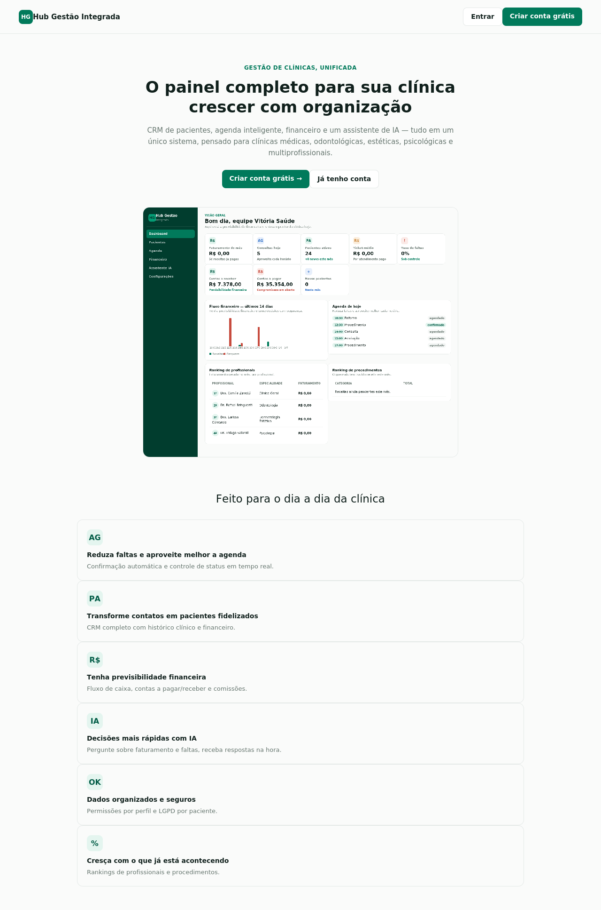
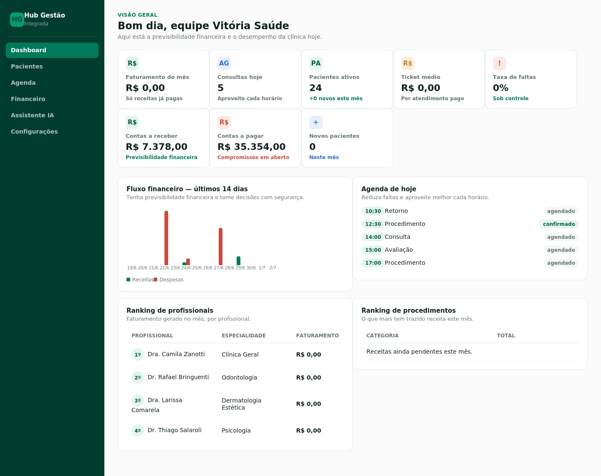
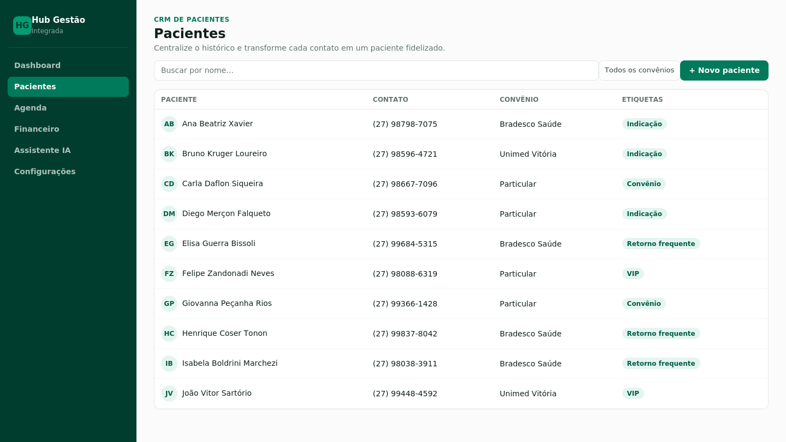
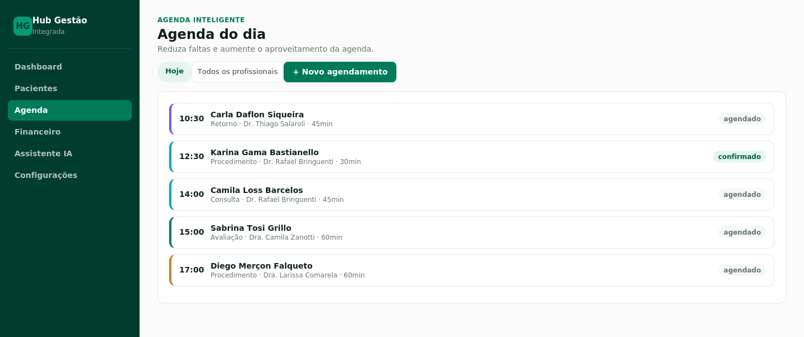
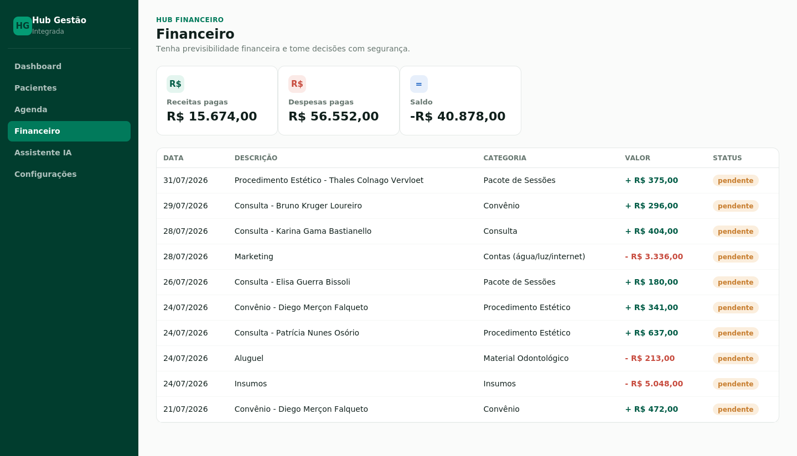

# Hub Gestão Integrada

Sistema web de gestão para clínicas médicas, odontológicas, estéticas, psicológicas e multiprofissionais — CRM de pacientes, agenda inteligente, financeiro e assistente de IA em um único painel.

Projeto em **JavaScript puro** (React no front-end, Node.js/Express no back-end), sem dependências de compilação nativa — roda em qualquer máquina com Node instalado, sem precisar de Docker, PostgreSQL ou banco externo.

> Área interna (dashboard) apenas — login/senha não fazem parte deste projeto, conforme escopo definido.

## Capturas de tela

| Landing (pública) | Login |
|---|---|
|  |  |

| Dashboard | Pacientes |
|---|---|
|  |  |

| Agenda | Financeiro |
|---|---|
|  |  |

## Autenticação

O app tem uma landing page pública na raiz (`/`) com botões de **Entrar** e **Criar conta grátis**. O painel interno (`/app/...`) fica protegido — tanto no frontend (redireciona para `/entrar` se não estiver logado) quanto na API (todas as rotas em `/api/*`, exceto `/api/auth/*` e `/api/health`, exigem um token válido).

- **Cadastro:** `/criar-conta` — cria um usuário novo (senha com mínimo 6 caracteres, hash com bcrypt)
- **Login:** `/entrar` — retorna um token JWT válido por 30 dias, guardado no `localStorage` do navegador
- **Conta de teste** (criada pelo `npm run seed`): `jonathan@clinicavitoria.com.br` / senha `clinica123`

> Em produção, defina a variável de ambiente `JWT_SECRET` com um valor aleatório próprio (no Render: Settings → Environment). Sem isso, o projeto usa um valor padrão de desenvolvimento — funciona, mas não é recomendado para uso real.

## Stack

- **Frontend:** React 19 + Vite, React Router, Recharts (gráficos), Lucide (ícones)
- **Backend:** Node.js + Express, API REST
- **Banco de dados:** arquivo JSON local via `lowdb` (zero configuração, zero build nativo — ideal para rodar em qualquer ambiente)
- **Dados de exemplo:** clínica fictícia em Vitória/ES, com pacientes, profissionais, agenda e financeiro pré-populados

## Estrutura

```
clinic-hub-app/
├── backend/
│   ├── server.js         # servidor Express, rotas e proteção de autenticação
│   ├── db.js              # camada de acesso ao banco (lowdb)
│   ├── seed.js             # gera dados de exemplo (inclui usuários e senha padrão)
│   ├── data/db.json       # "banco de dados" (JSON) - já vem populado
│   ├── middleware/auth.js  # validação do token JWT
│   └── routes/
│       ├── auth.js         # cadastro, login e usuário atual
│       ├── crud.js         # CRUD genérico (pacientes, agenda, financeiro...)
│       ├── dashboard.js    # métricas agregadas do dashboard
│       └── assistant.js    # assistente de IA baseado em regras
├── frontend/
│   └── src/
│       ├── pages/          # Landing, Login, Cadastro, Dashboard, Pacientes, Agenda, Financeiro, Assistente, Configurações
│       ├── components/     # Sidebar, AppLayout, ProtectedRoute, KPICard
│       ├── context/AuthContext.jsx  # estado de login (token, usuário, login/logout)
│       └── styles.css      # design system (cores, tipografia, componentes)
├── docs/screenshots/       # imagens usadas neste README
├── package.json            # scripts de build/start para deploy como serviço único
├── render.yaml              # blueprint de deploy no Render
└── LICENSE
```

## Como rodar localmente

Abra dois terminais.

**Terminal 1 — Backend**
```bash
cd backend
npm install
npm run seed     # popula/reseta os dados de exemplo (já vem rodado, mas pode rodar de novo)
npm start          # http://localhost:3333
```

**Terminal 2 — Frontend**
```bash
cd frontend
npm install
npm run dev        # http://localhost:5173
```

Abra `http://localhost:5173` no navegador. O Vite já está configurado para redirecionar chamadas `/api/*` para o backend na porta 3333 (veja `frontend/vite.config.js`).

## Deploy em produção (link fixo, grátis)

O projeto está preparado para rodar como **um único serviço**: o backend serve tanto a API quanto o frontend já compilado (`frontend/dist`), então não precisa de dois hosts nem configurar CORS entre domínios diferentes.

### Deploy no Render (recomendado, tem plano gratuito)

1. Crie uma conta em [render.com](https://render.com) e conecte sua conta do GitHub
2. **New +** → **Web Service** → selecione o repositório `hub-gestao-integrada`
3. Configure:
   - **Root Directory:** deixe em branco (raiz do repositório)
   - **Build Command:** `npm run build`
   - **Start Command:** `npm start`
   - **Plan:** Free
4. Clique em **Create Web Service**

O Render instala as dependências, builda o frontend e sobe o backend servindo tudo junto. Em alguns minutos você recebe uma URL fixa tipo `https://hub-gestao-integrada.onrender.com`.

> **Sobre os dados no plano gratuito:** o "banco de dados" é um arquivo JSON local (`backend/data/db.json`). No plano free do Render, o disco não é permanente entre reinicializações (o serviço dorme após ~15 min sem uso e acorda do zero). Ou seja: é ótimo para demonstração — sempre volta com os dados de exemplo originais —, mas não é adequado para uso real em produção com pacientes de verdade. Para isso, o próximo passo seria trocar o `lowdb` por um banco de verdade (Postgres, por exemplo) e usar um plano com disco persistente.

Também existe um `render.yaml` na raiz do projeto — no Render dá pra usar **New +** → **Blueprint** apontando pro repositório, que ele lê esse arquivo e configura tudo sozinho.

### Outras opções

Qualquer host que rode Node.js funciona do mesmo jeito (Build Command `npm run build`, Start Command `npm start`): Railway, Fly.io, Heroku, ou uma VPS comum.

## Módulos implementados (primeira rodada)

- **Dashboard** — faturamento do mês, consultas de hoje, pacientes ativos/novos, ticket médio, taxa de faltas, contas a pagar/receber, fluxo de caixa (gráfico), ranking de profissionais e de procedimentos
- **CRM de Pacientes** — cadastro, busca, filtro por convênio, prontuário (evolução clínica) e histórico financeiro por paciente, termo LGPD
- **Agenda Inteligente** — visão diária navegável, filtro por profissional, atualização de status inline (agendado / confirmado / concluído / faltou / cancelado), novo agendamento
- **Hub Financeiro** — lançamentos de receita/despesa, fluxo de caixa mensal (gráfico), filtros por tipo/status, contas a pagar e a receber
- **Assistente IA** — chat que responde perguntas sobre faturamento, taxa de faltas, pacientes inativos, ranking de profissionais e previsão de faturamento, analisando os dados reais da clínica (sem depender de API externa)
- **Configurações** — dados da clínica, meta de faturamento, comissão por profissional, perfis de acesso da equipe

## Módulos sugeridos para uma próxima rodada

(mesmo escopo do brief original, não incluídos nesta primeira versão)

- Marketing Digital (pipeline de leads, campanhas, ROI/CAC/LTV) — a base de dados de leads já existe na API (`/api/leads`), falta a interface
- Estoque (produtos, insumos, validade, lote)
- Portal do Paciente (login próprio, agendamento online, receitas/exames)
- Gestão de Equipe mais completa (escalas, metas individuais, produtividade)
- Central de Integrações (WhatsApp Business API, Google Agenda/Meet, PIX, Mercado Pago, Stripe, N8N, Zapier)

## Personalizando

- **Cor da marca:** altere as variáveis `--verde-*` em `frontend/src/styles.css`
- **Dados da clínica:** edite pela tela de Configurações no app, ou diretamente em `backend/data/db.json`
- **Repopular dados de exemplo:** `cd backend && npm run seed` (isso **substitui** os dados atuais)

## Licença

Distribuído sob a licença MIT — veja [LICENSE](LICENSE).
